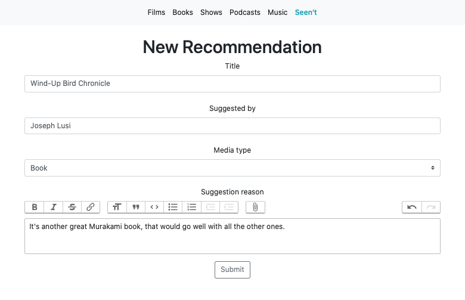
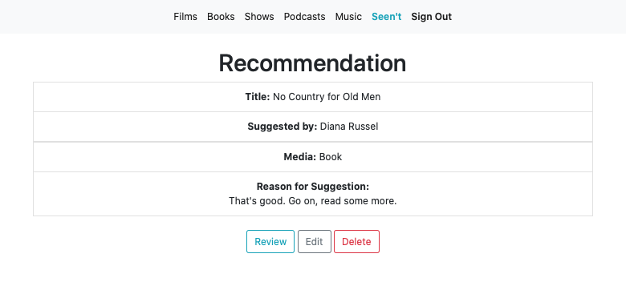
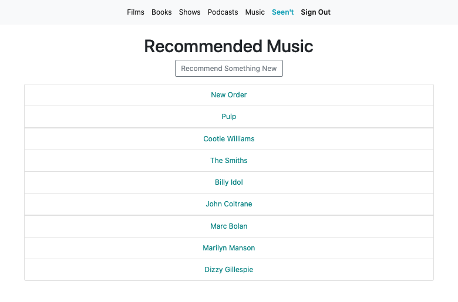
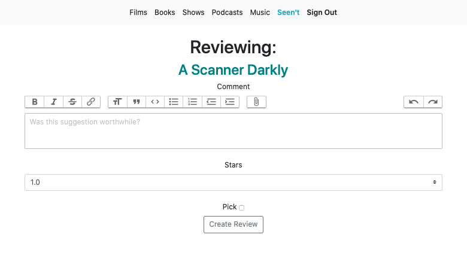
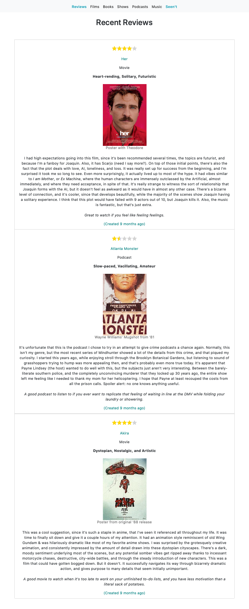

[](https://app.codeship.com/projects/354250)

# Gives new meaning to 'I'll put it on the list'

## Purpose

I use this application to keep track of various recommendations from friends, and I sort, rate, & review their suggestions once I've watched them. This was initially created as an example application to demonstrate my favorite pipeline for a blog post I was writing [here](https://medium.com/@oh_boyd/from-a-new-app-to-deployment-using-postgres-rspec-github-heroku-and-codeship-aa80a020da10), but it's since become something that I really enjoy using. To build something similar, I've also described the step-by-step process I took in [this medium article](https://medium.com/@oh_boyd/the-movie-list-an-application-to-prove-that-im-probably-going-to-get-around-to-watching-the-7fe35c1cdf03).

## Setup

If you like this, and want to keep track of your friends' suggestions too, feel free to use the instructions below to set up your own version! Moreover, please add your suggestions to my personal app, if you have anything you'd like to suggest!

- After cloning the project, run `bundle install`

- Open the app in your text editor

- Create a file named `.env` in the root directory of the file structure

- Add two environment variables to that new `.env` file with the names below (replace `productionkey` and `productionsecret` with your own personal values):

  ```
    AWS_ACCESS_KEY_ID=productionkey
    AWS_SECRET_ACCESS_KEY=productionsecret
  ```

- Open `.gitignore` file and add the `.env` file to the list of files that won't be committed to GitHub

- Run `rails db:create && rails db:migrate && rails db:seed` in your console

- Run `rails s` and visit [localhost:3000](http://localhost:3000)

## Technologies

- Rails 6.0

- This is using JQuery-UI and AJAX to make the recommendations sortable without having to refresh the page

- The deployment pipeline moves from GitHub -> CodeShip CI -> Heroku

- AWS S3 & Active Storage for imbedded images and other attachments

- Action Text for user-friendly Rich Text formatting

## Worthwhile Gems

- [dotenv](https://github.com/bkeepers/dotenv) for loading environment variables easily

- [faker](https://github.com/faker-ruby/faker) to generate fun mock data for the seeds

- [rspec](https://github.com/rspec/rspec-rails) for the test suite

- [factory bot](https://github.com/thoughtbot/factory_bot_rails) to generate quasi-fixtures for easy testing

- [capybara](https://github.com/teamcapybara/capybara) for testing the user interactions

## Glamourshots










